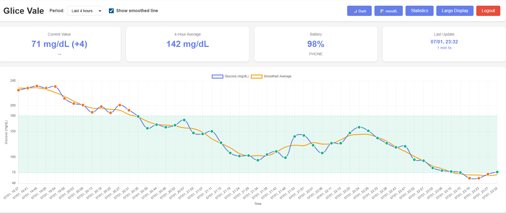
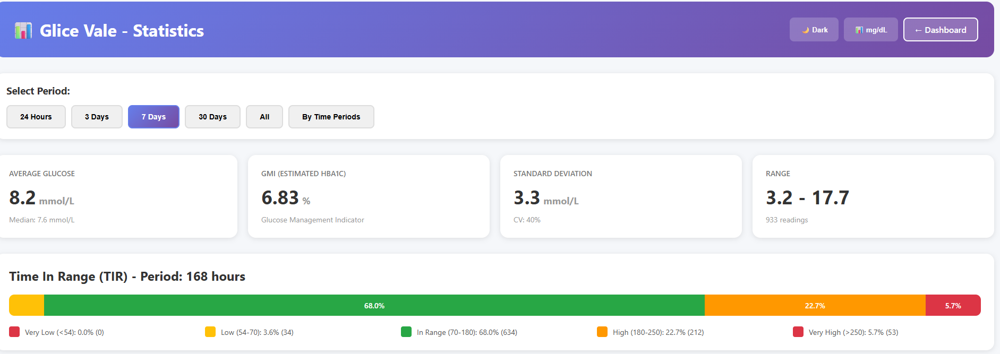
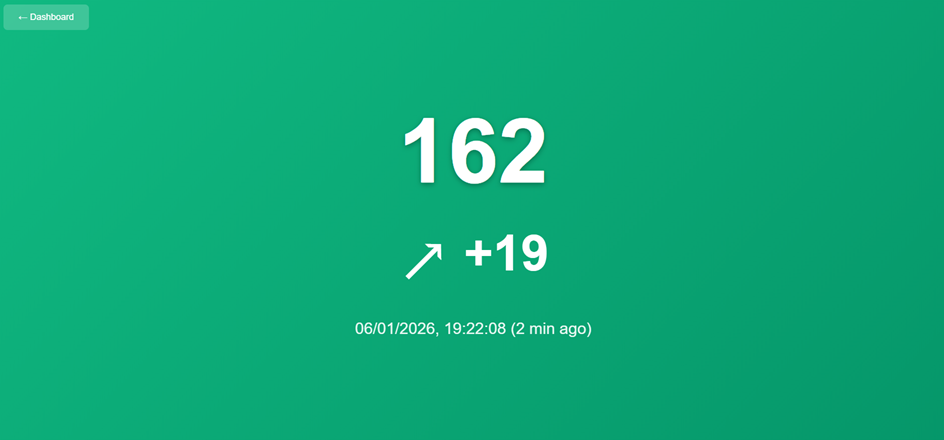

# xDrip Dashboard

Blood glucose monitoring system for xDrip+ with interactive web dashboard and advanced logging.







## 📋 Features

### 🔄 xDrip Data Reception
- REST API endpoint to receive glucose data from xDrip+
- Automatic saving to SQLite database
- Support for entries (glucose values) and devicestatus (battery)
- Protected with secret key

### 📊 Web Dashboard
- **Interactive chart** with Chart.js
  - Multi-period visualization (4, 8, 12, 18, 24, 48 hours)
  - Highlighted target glucose range (70-180 mg/dL)
  - Color-coded points based on target range
  - Directional arrows for trends
  - **Smoothed trend line** using moving average
    - Toggle on/off with checkbox
    - Smooths fluctuations while following real trends
    - Orange line for easy distinction
  
- **Real-time statistics**
  - Current value with delta
  - Average for selected period
  - Device battery level
  - Last update with time elapsed

- **Advanced Statistics Page**
  - Multiple time period analysis (24h, 3 days, 7 days, 30 days, all data)
  - Complete glucose metrics:
    - Average, median, standard deviation
    - GMI (Glucose Management Indicator / estimated HbA1c)
    - Coefficient of Variation (CV)
    - Min/max values
  - **Time In Range (TIR)** visualization
    - Interactive bar chart with 5 segments
    - Very Low (<54 mg/dL), Low (54-70), In Range (70-180), High (180-250), Very High (>250)
    - Percentages and absolute counts
  - **Time period analysis** (night, morning, afternoon, evening)
    - Statistics by daily time slot
    - Mini TIR charts for each period
    - Period-specific averages and variability
  - Default view: 7 days statistics

- **Large Display**
  - Full screen visualization
  - Dynamic background (green in target, orange out of range)
  - Ideal for always-on monitors

- **🌙 Dark Mode**
  - Toggle button on all pages
  - Preference saved in browser (localStorage)
  - Smooth transitions between light/dark themes
  - Optimized colors for night viewing
  - Applies to dashboard, statistics, and all components

- **📊 Multiple Unit Display (mg/dL or mmol/L)**
  - Toggle button on dashboard and statistics pages
  - Switch between mg/dL and mmol/L in real-time
  - Preference saved in browser (localStorage)
  - Separate customizable target ranges for each unit
  - All values automatically converted:
    - Current glucose value
    - Delta (variation)
    - Average and statistics
    - Chart axis and labels
    - Large display page
  - Proper rounding: integers for mg/dL, 1 decimal for mmol/L

### 🔐 Security
- Password authentication for dashboard
- Secret key for xDrip API
- Protected Flask sessions
- **Login attempt protection**
  - Maximum 3 failed login attempts per IP address
  - 10-minute automatic block after exceeding limit
  - Real-time feedback on remaining attempts
  - Automatic reset after successful login or block expiration
  - Complete logging of failed attempts and blocks

### 📝 Logging
- Automatic rotation every 24 hours (midnight)
- Retention of last 30 days
- Logs to file and console
- Tracking of:
  - Application start and shutdown
  - xDrip data reception
  - Errors and exceptions
  - Unauthorized access attempts

## 🚀 Installation

### Requirements
- Python 3.7+
- SQLite3

### Dependencies
```bash
pip install flask waitress
```

### Configuration
Edit the following variables at the beginning of `xdrip.py`: (where USER is your username)

```python
DB_PATH = Path("/home/USER/xdrip/xdrip.db")  # Database path
SECRET = "MYSECRET"  # Secret for xDrip API
DASHBOARD_PASSWORD = "MYPASSWORD"  # Dashboard password
LOGS_DIR = Path("/home/USER/xdrip/logs")  # Logs folder
DASHBOARD_TITLE = "My xDrip"  # Custom title

# xDrip unit configuration
XDRIP_UNIT = "mg/dl"  # Unit xDrip sends data in: "mg/dl" or "mmol/L"

# Target limits for mg/dL
TARGET_MIN = 70  # Minimum target limit (mg/dL)
TARGET_MAX = 180  # Maximum target limit (mg/dL)

# Target limits for mmol/L (used when viewing in mmol/L)
TARGET_MIN_MMOL = 3.9  # Minimum target limit (mmol/L)
TARGET_MAX_MMOL = 10.0  # Maximum target limit (mmol/L)
```

## 💻 Usage

### Standard Start
```bash
python3 xdrip.py
```
Production server on http://0.0.0.0:3000 (Waitress)

### Background Start (Linux/Unix)
```bash
python3 xdrip.py daemon
# or
python3 xdrip.py background
```
- Runs as a daemon process (detached from terminal)
- Process runs in the background independently
- Terminal is freed immediately after launch
- PID saved in `logs/xdrip.pid`
- Logs output only to file (not console)
- Survives terminal closure
- **Linux/Unix only** (requires fork support)

**On Windows**: Use `pythonw xdrip.py` to run without console window

### Background Process Management
```bash
# Check if daemon is running
ps aux | grep xdrip

# View the process ID
cat /home/USER/xdrip/logs/xdrip.pid

# Stop the daemon
kill $(cat /home/USER/xdrip/logs/xdrip.pid)

# Gracefully stop with SIGTERM
kill -15 $(cat /home/USER/xdrip/logs/xdrip.pid)

# View logs in real-time
tail -f /home/USER/xdrip/logs/xdrip.log

# Start at system boot (systemd example)
# Create /etc/systemd/system/xdrip.service
[Unit]
Description=xDrip Dashboard Service
After=network.target

[Service]
Type=forking
User=YOUR_USER
WorkingDirectory=/home/YOUR_USER/xdrip
ExecStart=/usr/bin/python3 /path/to/xdrip.py daemon
PIDFile=/home/YOUR_USER/xdrip/logs/xdrip.pid
Restart=on-failure

[Install]
WantedBy=multi-user.target
```

### Development Mode
```bash
python3 xdrip.py dev
```
- Flask development server
- Debug active
- Auto-reload on file changes

### Daemon Process Control
```bash
# Check if running
ps aux | grep xdrip

# Display PID
cat /home/USER/xdrip/logs/xdrip.pid

# Stop process
kill $(cat /home/USER/xdrip/logs/xdrip.pid)

# View logs in real-time
tail -f /home/USER/xdrip/logs/xdrip.log
```

## 🔧 xDrip+ Configuration

### Check xDrip Unit Setting
Before configuring the API, check which unit xDrip is using:
1. Open xDrip+ app
2. Go to **Settings** → **Less Common Settings** → **Extra Settings** → **Glucose Units**
3. Note the selected unit (mg/dL or mmol/L)
4. Update `XDRIP_UNIT` in `xdrip.py` to match this setting

**Important**: The `XDRIP_UNIT` setting tells the system how to interpret incoming data from xDrip. If xDrip sends mmol/L but you configure mg/dL (or vice versa), values will be incorrect!

### Upload API
1. Open xDrip+ → Settings → Cloud Upload
2. Enable "REST API Upload"
3. Set base URL: `http://YOUR_SERVER:3000/xdrip/MYSECRET`
4. Replace `MYSECRET` with your configured SECRET

### Data Storage
- All data is automatically converted and stored in **mg/dL** in the database
- You can view data in either unit (mg/dL or mmol/L) in the dashboard
- The conversion is automatic regardless of `XDRIP_UNIT` setting

### API Endpoints
- **Entries**: `POST /xdrip/<secret>/entries`
- **Device Status**: `POST /xdrip/<secret>/devicestatus`

## 🌐 Dashboard Access

### Login
`http://YOUR_SERVER:3000/dashboard/login`
- Username: none
- Password: configured in `DASHBOARD_PASSWORD`

### Main Dashboard
`http://YOUR_SERVER:3000/dashboard`
- Interactive chart
- Period selection (4h, 8h, 12h, 18h, 24h, 48h)
- Complete statistics
- Smoothed trend line toggle
- Dark mode toggle
- **📊 Unit toggle** (mg/dL ↔ mmol/L)

### Statistics Page
`http://YOUR_SERVER:3000/dashboard/statistics`
- Comprehensive glucose analysis
- Multiple period selection (24h, 3 days, 7 days, 30 days, all data)
- Time In Range (TIR) visualization
- Time period analysis (night, morning, afternoon, evening)
- GMI and CV calculations
- Dark mode support
- **📊 Unit toggle** (mg/dL ↔ mmol/L)

### Large Display
`http://YOUR_SERVER:3000/dashboard/display`
- Full screen visualization
- Automatic update every 30 seconds
- Color-coded background based on target
- **Automatic unit preference** (uses saved setting from dashboard)

### Logout
`http://YOUR_SERVER:3000/dashboard/logout`

## 📁 File Structure

```
xdripApi/
├── xdrip.py          # Main script
├── README.md         # This documentation
└── [configuration]
    ├── xdrip.db      # SQLite database (automatically created)
    └── logs/
        ├── xdrip.log       # Current log
        ├── xdrip.log.2026-01-05  # Previous logs
        └── xdrip.pid       # Daemon process PID
```

## 🗄️ Database

### Table `entries`
Glucose values received from xDrip+
```sql
- id: INTEGER PRIMARY KEY
- device: TEXT
- date_ms: INTEGER (UNIQUE)
- timestamp_utc: TEXT
- sgv: INTEGER (mg/dL - always stored in mg/dL regardless of xDrip unit)
- direction: TEXT
- created_at: TIMESTAMP
```
**Note**: All glucose values are stored in mg/dL internally, even if xDrip sends data in mmol/L.

### Table `devicestatus`
Device status (battery, etc.)
```sql
- id: INTEGER PRIMARY KEY
- device: TEXT
- battery: INTEGER
- uploader_type: TEXT
- timestamp_utc: TEXT
- created_at: TIMESTAMP
```

## 📊 Automatic Updates

- **Dashboard**: every 60 seconds
- **Display**: every 30 seconds
- **Log rotation**: midnight every day

## 🔍 Troubleshooting

### Wrong glucose values displayed
If values seem incorrect (too high or too low by ~18x):
1. Check `XDRIP_UNIT` setting in `xdrip.py`
2. Verify xDrip unit in app: Settings → Less Common Settings → Extra Settings → Glucose Units
3. Make sure `XDRIP_UNIT` matches your xDrip configuration
4. If you changed the setting, existing data in database won't be affected (already in mg/dL)

### Server won't start
```bash
# Verify that Waitress is installed
pip install waitress

# Check logs
cat /home/USER/xdrip/logs/xdrip.log
```

### xDrip not sending data
1. Verify URL and secret key
2. Check that server is reachable from network
3. Check logs for authentication errors

### Login blocked
If you see "Too many failed attempts":
1. Wait 10 minutes for automatic unblock
2. Check correct password in `xdrip.py` configuration
3. Each IP address is tracked independently
4. Block is automatically lifted after timeout

### Daemon process won't start
```bash
# Only Linux/Unix supports daemon mode
# On Windows use: pythonw xdrip.py
```

### Permission errors
```bash
# Make sure folders are writable
chmod -R 755 /home/USER/xdrip
```

## 🎨 Customization

### Unit Display Preferences
Unit preference (mg/dL or mmol/L) is automatically saved in browser's localStorage and persists across sessions. Toggle using the 📊 button available on:
- Main Dashboard (next to Dark mode button)
- Statistics Page (next to Dark mode button)
- Large Display (automatically uses saved preference)

**Conversion formula**: mmol/L = mg/dL ÷ 18.0

### Dark Mode
Dark mode preference is automatically saved in browser's localStorage and persists across sessions. Toggle using the 🌙 Dark button available on:
- Main Dashboard
- Statistics Page

### Change dashboard colors
Edit CSS in the `DASHBOARD_TEMPLATE`, `STATISTICS_TEMPLATE`, and `DISPLAY_TEMPLATE` templates

Light mode colors:
```css
body { background: #f5f5f5; }
.stat-card { background: white; }
```

Dark mode colors:
```css
body.dark-mode { background: #1a1a2e; }
body.dark-mode .stat-card { background: #0f3460; }
```

### Adjust smoothed line sensitivity
In `calculateSmoothedLine()` function, modify the window size:
```javascript
const windowSize = 5; // Default: 5 points (2 before, current, 2 after)
// Increase for more smoothing (e.g., 7 or 9)
// Decrease for less smoothing (e.g., 3)
```

### Change update intervals
```javascript
// Dashboard (default 60 seconds)
setInterval(() => { loadData(); }, 60000);

// Display (default 30 seconds)
setInterval(updateDisplay, 30000);
```

### Add new visualization periods
Edit the array in `get_data()`:
```python
if hours not in [4, 8, 12, 18, 24, 48, 72]:  # Added 72 hours
```

And in statistics API routes, modify `get_stats()`, `get_all_stats()`, and `get_period_stats()` functions.

### Customize Time In Range thresholds
Edit constants at the beginning of `xdrip.py`:
```python
# Target ranges for mg/dL
TARGET_MIN = 70  # Lower target limit
TARGET_MAX = 180  # Upper target limit

# Target ranges for mmol/L (used when viewing in mmol/L)
TARGET_MIN_MMOL = 3.9  # Lower target limit
TARGET_MAX_MMOL = 10.0  # Upper target limit

# Severe thresholds
VERY_LOW_THRESHOLD = 54  # mg/dL - Severe hypoglycemia
VERY_HIGH_THRESHOLD = 250  # mg/dL - Severe hyperglycemia
VERY_LOW_THRESHOLD_MMOL = 3.0  # mmol/L - Severe hypoglycemia
VERY_HIGH_THRESHOLD_MMOL = 13.9  # mmol/L - Severe hyperglycemia
```

**Note**: You can set different target ranges for mg/dL and mmol/L viewing. The system uses the appropriate targets based on the selected unit.

### Modify time period analysis
In `get_period_stats()`, customize daily time slots:
```python
'night': get_time_period_stats(data, 0, 6, 'Night (00:00-06:00)'),
'morning': get_time_period_stats(data, 6, 12, 'Morning (06:00-12:00)'),
'afternoon': get_time_period_stats(data, 12, 18, 'Afternoon (12:00-18:00)'),
'evening': get_time_period_stats(data, 18, 24, 'Evening (18:00-24:00)')
```

## 📝 Logs

Logs include:
- `INFO`: Normal operations (start, data reception, saving, successful logins)
- `WARNING`: Unauthorized access attempts, failed login attempts, IP blocks
- `ERROR`: Handled errors (DB, JSON parsing)
- `CRITICAL`: Fatal errors

Log format:
```
2026-01-06 15:30:45 - INFO - Entry saved: sgv=120 mg/dL, direction=Flat
2026-01-06 15:30:46 - INFO - Entry saved: sgv=108 mg/dL (received: 6.0 mmol/L), direction=Flat
2026-01-06 15:31:00 - WARNING - Unauthorized access attempt
2026-01-06 15:32:15 - WARNING - Failed login attempt from IP 192.168.1.100. Total attempts: 2
2026-01-06 15:32:45 - WARNING - IP 192.168.1.100 blocked for 10 minutes after 3 failed attempts
2026-01-06 15:45:00 - INFO - Successful login from IP 192.168.1.100
```

**Note**: When `XDRIP_UNIT = "mmol/L"`, logs show both the stored value (mg/dL) and the received value (mmol/L) for transparency.

## 🚦 Target Limits

Target glucose limits are configurable separately for each unit:

**For mg/dL viewing:**
```python
TARGET_MIN = 70   # mg/dL - Lower limit
TARGET_MAX = 180  # mg/dL - Upper limit
```

**For mmol/L viewing:**
```python
TARGET_MIN_MMOL = 3.9   # mmol/L - Lower limit
TARGET_MAX_MMOL = 10.0  # mmol/L - Upper limit
```

Values in range: **green**  
Values out of range: **orange/red**

The system automatically uses the correct targets based on the selected display unit.

## 📞 Support

For issues or questions:
1. Check logs: `tail -f logs/xdrip.log`
2. Verify configuration
3. Test API endpoints manually

## 📄 License

Personal use - Not for commercial distribution

---

**Version**: 3  
**Date**: 7 January 2026  


